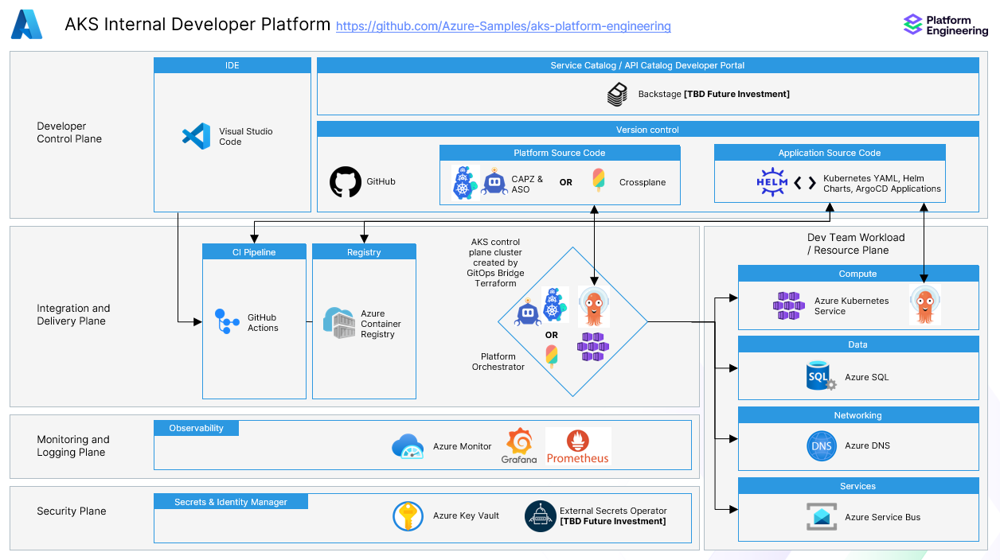

# Building a Platform Engineering Environment on Azure Kubernetes Service (AKS)

At its core, platform engineering is about constructing a solid and adaptable groundwork that simplifies and accelerates the development, deployment, and operation of software applications.  The goal is to abstract the complexity inherent in managing infrastructure and operational concerns, enabling dev teams to focus on crafting code that adds direct value. This environment is based on GitOps principles and includes a set of best practices and tools to manage the lifecycle of the applications and the underlying infrastructure. Many platform teams use multiple clusters to separate concerns and provide isolation between different environments, such as development, staging, and production. This guide provides a reference architecture and sample to build a platform engineering environment on Azure Kubernetes Service (AKS).

This sample will illustrate an end-to-end workflow that Platform Engineering and Development teams need to deploy multi-cluster environments on AKS:

- Platform Engineering team deploys a control plane cluster with core infrastructure services and tools to support Day 2 Operations using Terraform and ArgoCD.
- When a new development team is on boarded, the Platform Engineering team provisions new clusters dedicated to that team.  These new clusters will automatically have common required infrastructure tools installed via ArgoCD and have ArgoCD installed automatically.
- The development team optionally installs additional infrastructure tools and customizes the Kubernetes configuration as desired with potential limits enforced by policies from the Platform Engineering team.
- The development team deploys applications using GitOps principles and ArgoCD.

## Architecture

This sample leverages the [GitOps Bridge Pattern](https://github.com/gitops-bridge-dev/gitops-bridge?tab=readme-ov-file).  The following diagram shows the high-level architecture of the solution:  


The control plane cluster will be configured with addons via ArgoCD using Terraform and then bootstrapped with tools needed for Day Two operations.  

Choose Crossplane **or** Cluster API provider for Azure (CAPZ) to support deploying and managing clusters and Azure infrastructure for the application teams by changing the Terraform `infrastructure_provider` variable to either `crossplane` or `capz`.  The default is `crossplane` if no value is specified.  The CAPZ option also automatically installs Azure Service Operator (ASO) so any Azure resource can be provisioned as long as the [CRD pattern](https://azure.github.io/azure-service-operator/guide/crd-management/#automatic-crd-installation-recommended) is specified for desired resources [in the helm values file which installs CAPZ](https://github.com/Azure-Samples/aks-platform-engineering/blob/main/gitops/environments/default/addons/cluster-api-operator/values.yaml#L12).

## Prerequisites

- An active Azure subscription. If you don't have one, create a free Azure account before you begin.
- Azure CLI version 2.60.0 or later installed. To install or upgrade, see Install Azure CLI.
- Terraform v1.8.3 or later [configured for authentication](https://learn.microsoft.com/azure/developer/terraform/authenticate-to-azure?tabs=bash) where the user account has permissions to create resource groups and user managed identities on the subscription to setup workload identity for the AKS cluster (capz option).
- kubectl version 1.28.9 or later installed. To install or upgrade, see Install kubectl.

## Getting Started

### Provisioning the Control Plane Cluster

- Fork the repo
- If the repo is or desired to be private, ArgoCD will need a ssh deploy key to access this repo. Create a [read-only deploy ssh key](https://docs.github.com/en/authentication/connecting-to-github-with-ssh/managing-deploy-keys#deploy-keys) on the fork and place the corresponding private key named `private_ssh_deploy_key` in the `terraform` directory.

Run Terraform:

```bash
cd terraform
terraform init -upgrade
```

Choose to apply capz or crossplane.  Change `Azure-Samples` to your fork organization.  Alternatively, consider changing the example `tvars` file to match your desired configuration versus using the `-var` switches below.

```bash
# The gitops_addons_org needs to be in the git format to use the SSH key unless the repo is public

# For capz control plane
terraform apply -var gitops_addons_org=git@github.com:Azure-Samples \
                -var gitops_workload_org=git@github.com:Azure-Samples \
                -var infrastructure_provider=capz

# For crossplane control plane
terraform apply -var gitops_addons_org=git@github.com:Azure-Samples \
                -var gitops_workload_org=git@github.com:Azure-Samples
```

Terraform completed installing the AKS cluster, installing ArgoCD, and configuring ArgoCD to install applications under the <> directory from the git repo.

### Accessing the Control Plane Cluster and ArgoCD UI

Getting the credentials for the Control Plane Cluster

```shell
export KUBECONFIG=<your_path_to_this_repo>/aks-platform-engineering/terraform/kubeconfig
```

```shell
# Get the initial admin password and the IP address of the ArgoCD web interface.
kubectl get secrets argocd-initial-admin-secret -n argocd --template="{{index .data.password | base64decode}}"
kubectl get svc -n argocd argo-cd-argocd-server
```

It may take a few minutes for the LoadBalancer to create a public IP for the ArgoCD UI after the Terraform apply. In case something goes wrong and you don't find a public IP, connect to the ArgoCD server doing a port forward with kubectl and access the UI on https://localhost:8080.

```kubectl
kubectl port-forward svc/argo-cd-argocd-server -n argocd 8080:443
```

The username for the ArgoCD UI login is `admin`.

### Summary

1. Terraform created an AKS control plane / management cluster and downloaded the kubeconfig file in the `terraform` directory.
1. Terraform installed ArgoCD via the Terraform Kubernetes provider to that cluster
1. Terraform did a `kubectl apply` an ArgoCD ApplicationSet to the cluster which syncs the bootstrap folder [gitops/bootstrap/control-plane/addons](https://github.com/Azure-Samples/aks-platform-engineering/tree/main/gitops/bootstrap/control-plane/addons). That ApplicationSet utilizes the [ArgoCD App of Apps pattern](https://argo-cd.readthedocs.io/en/stable/operator-manual/cluster-bootstrapping/#app-of-apps-pattern) and ArgoCD applies all of the applications under that folder in git which match the [labels specified in Terraform](https://github.com/Azure-Samples/aks-platform-engineering/blob/main/terraform/main.tf#L20-L38).

## Next Steps

Learn how to define your own cluster, infrastructure, and hand off to the development team the access to the AKS cluster and ArgoCD deployment UI in [this article](./docs/Onboard-New-Dev-Team.md).
