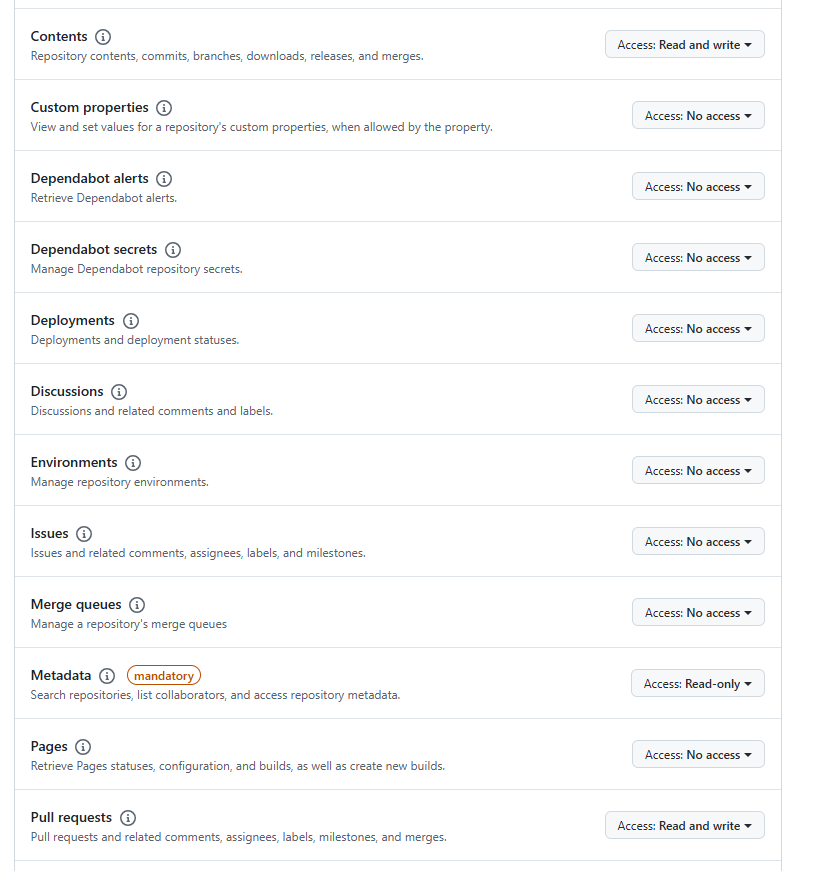
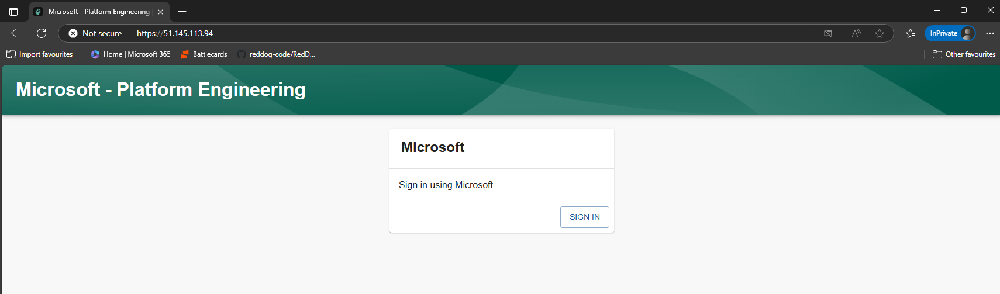
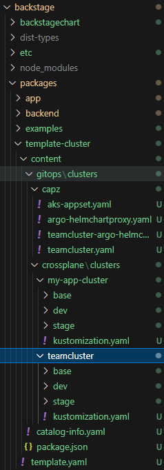

# Backstage

## Overview

Backstage is an open platform for building developer portals. It was created by Spotify to streamline their development processes and has since been open-sourced. Backstage allows you to manage all your infrastructure, services, and tools in one place, providing a unified developer experience.

## Features

- **Service Catalog**: Organize and manage all your services.
- **Software Templates**: Standardize and automate the creation of new projects.
- **TechDocs**: Centralize your documentation.
- **Plugins**: Extend Backstage with a wide range of plugins.

## Context in This Project

In this project, Backstage is used to provide a unified developer portal that integrates various tools and services. It helps in managing the infrastructure and services more efficiently. The project leverages Backstage to:

- **Centralize Documentation**: Using TechDocs to keep all documentation in one place.
- **Manage Services**: Using the Service Catalog to organize and manage microservices.
- **Automate Workflows**: Using Software Templates to standardize project creation.


## Getting Started

  To get started with Backstage in this project, follow these steps:

1. **Fork & Clone the Repository**:
    - First, fork the repository to your own GitHub account by clicking the "Fork" button on the repository page.
    - Then, clone your forked repository:
    ```sh
    git clone https://github.com/<your_fork>/aks-platform-engineering.git
    cd aks-platform-engineering/terraform
    ```

    NEED TO ADD SELF CERT GENERATION FROM OPENSSL.CNF FILE

2. **Deploy Terraform with Backstage**:
    To deploy Backstage, you can use the provided Terraform scripts. Navigate to the `terraform` directory and apply the configuration:
    ```sh
    cd terraform
    terraform apply -var build_backstage=true -var gitops_addons_org=https://github.com/owainow -var github_token=<your github token> --auto-approve
    ```

    > **Note:** GitHub PAT's can be created under your GitHub account under "Developer Settings". The required GitHub token permissions for Backstage in this case are related to the repository creation. The tempalte provided will create a new file in your forked repo. For classic GH PAT's this will be full repo access to create PR's and commit changes. For fine grained tokens this will be contents Read and Write and Pull Requests Read and Write permissions at the repository level. 

    

    Example of required GitHub Permissions
 
 
    > **Note:** There is an alert generated in the terraform output that informs you to go to your newly created backstage SP and "Grant Admin" to the SP. This is because onboarding all users from your entra tenant requires admin privileges. If you don't do this prior to Backstage deploying you will have to wait for the scheduled task to run again (Once an hour) or manually populate the users in the backstage user table. This can be done through the Azure portal at the following location: Entra - App registrations - Backstage - API Permissions - <click> Grant admin consent. This can also be done using the CLI with the following command: az ad app permission admin-consent --id <ApplicationId>.
 
 
 
3.  **OpenSSL Config File for self signed Backstage cert**:
    > **Note:** This step will be removed in the future and this part will be automated. For more information on the steps required to automate this self signed certificate request please refer to PR 102. 

    At the moment our tls secret on the cluster has been created with a dummy key and crt file. As we require a self signed certificate against the Public IP assigned to the Backstage service upon creation we will need to generate a new set of keys and recreate the kubernetes secret. We can do this with the following steps:

    1. Update the terraform/openssl.cnf file with your Backstage Public IP in the two places specified in the file
    2. Run the following command to recreate the tls key & crt: openssl req -x509 -nodes -days 365 -newkey rsa:2048 -keyout tls.key -out tls.crt -config openssl.cnf
    3. Once created connect to your AKS cluster (Either through the CloudShell, CLI or Invoke Command) and run the following commands:
        ``` 
        kubectl delete secret my-tls-secret -n backstage
        kubectl create secret tls my-tls-secret --key=tls.key --cert=tls.crt -n backstage
        kubectl rollout restart deployment backstage-backstagechart -n backstage
        ```

 
  
 
4. **Access Backstage and Login**:
    To access Backstage navigate to the Azure Portal and view the external IP of your Backstage Service. You should be able to click on this link and access the IP address in the portal using Https. You can copy the IP address into your portal as follows "https://<BACKSTAGE_IP>"

    

    Once presented with the Backstage login simply follow the Azure Entra login flow to authenticate to Azure. Your users should have been automatically been onboarded into Backstage via the Entra Auth plugin. If your users have not been onboarded review the logs of your Backstage Instance and identify the MSGraph output stating the users and groups that have been added. Users are required to have a "Mail Account" (Email associated) to be added. The plugin also runs periodically so can take up to an hour to sync new users. Alternatively users can be manually added to the database. 

 
 
## Optional - Building Backstage Image
This repo uses a hosted backstage image with entra auth enabled, automatically onboarding users into your backstage user list. It also has an example software catalog template to demo creating the resources required for argo to create and bootstrap a cluster named by the user. If you want to test Backstage please continue to getting started. 

If you want to make changes to this image such as adding a different domain or new software catalogs you will need to make your changes, build your own image and change the deployment manifest to reference the image you have created. The source code for Backstage is found in the root Backstage folder. To build the image follow the steps below:

1. **Fork & Clone the Repository**:
    - First, fork the repository to your own GitHub account by clicking the "Fork" button on the repository page.
    - Then, clone your forked repository:
    ```sh
    git clone https://github.com/<your_fork>/aks-platform-engineering.git
    cd aks-platform-engineering/backstage

2. **Install Dependencies**: Ensure all dependencies are installed by running:

    ```sh
    yarn install
    ```
3. **Optional - Making Changes - New Software Template**
    In the provided image a software template is available that steps through the creation of a new cluster by a developer and handles submitting a PR that can be approved ready for the GitOps operator to reconcile the new requirement of a cluster. Due to the structure of the cluster creation in this repository a fair number of files and folders are bundled into the image to be modified and added to the PR. To avoid duplication these are not pushed into this repository under the backstage/packages/templatecluster folder. The example template.yaml is still present. If you would like to include this within your own folder simply copy the contents of the gitops/clusters folder into a subfolder within template-cluster called "content". See the structure below: 

    

    This will enable the example template to run in your own image or serve as an example to build from to create your own software template and understand the interaction between the template.yaml and example files. 


4. **Build the Project**: Run the build script defined in your `package.json`. Based on your previous commands, it looks like you need to build the backend:

    ```sh
    yarn build:backend --config ../../app-config-local.yaml
    ```

5. **Optional - Run the Application Locally**: After building the project, you can run it locally. Ensure that all necessary environment variables are set:

    ```sh
    export POSTGRES_HOST=your-local-postgres-host
    export POSTGRES_PORT=your-local-postgres-port
    export POSTGRES_USER=your-local-postgres-user
    export POSTGRES_PASSWORD=your-local-postgres-password
    export POSTGRES_DB=your-local-postgres-db

    yarn start
    ```

6. **Ensure Azure CLI is Installed**: Make sure you have the Azure CLI installed and logged in. If not, install it from [here](https://docs.microsoft.com/en-us/cli/azure/install-azure-cli) and log in using:

    ```sh
    az login
    ```

7. **Set Environment Variables**: Set the `ACR_NAME` and `RESOURCE_GROUP` environment variables:

    ```sh
    export ACR_NAME=your_acr_name
    export RESOURCE_GROUP=your_resource_group
    ```

8. **Build the Docker Image Locally**: Use the `docker build` command to build your Docker image:

    ```sh
    docker build -t $ACR_NAME.azurecr.io/my-backend-app:latest .
    ```

9. **Login to Azure Container Registry**: Use the Azure CLI to log in to your ACR:

    ```sh
    az acr login --name $ACR_NAME --resource-group $RESOURCE_GROUP
    ```

10. **Push the Docker Image to ACR**: Push the built image to your ACR:

    ```sh
    docker push $ACR_NAME.azurecr.io/my-backend-app:latest
    ```

11. **Verify the Image in ACR**: You can verify that the image has been pushed to ACR by listing the repositories:

    ```sh
    az acr repository list --name $ACR_NAME --output table
    ```


## FAQ & Troubleshooting

1. 403 Odata error:

If this error occurs on terraform apply:
│ ApplicationsClient.BaseClient.Post(): unexpected status 403 with OData error: Authorization_RequestDenied: Insufficient privileges to complete the operation.
Give Application.ReadWrite.All permissions.

## Additional Resources

- [Backstage Documentation](https://backstage.io/docs)
- [Spotify's Backstage Blog](https://backstage.io/blog)
- [Project README](../README.md)
